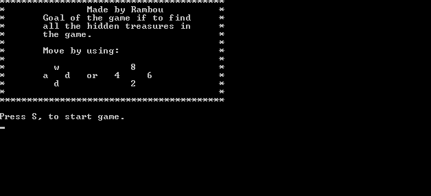

# Treasure-Hunt
A simple console based game implemented in C. The goal of the game is to find all the treasures in the map! Happy findings!!!

Here is a sample of the game!



## How to Play

### Controls
Use the arrow keys or WASD to move the player:
- **Up Arrow / W:** Move player up
- **Down Arrow / S:** Move player down
- **Left Arrow / A:** Move player left
- **Right Arrow / D:** Move player right

### Objective
The goal of the game is to collect all the treasures scattered throughout the map.

## Features
- Engaging treasure hunting gameplay
- Simple text-based graphics
- Console-based interface
- Dynamically generated map with fixed dimensions (23x79)
- Treasure counter to track progress

## Installation/Compilation

This game is written in C and can be compiled using a standard C compiler like GCC.

**Steps to compile and run:**

1.  **Compile the code:**
    Open your terminal or command prompt and navigate to the directory containing `Main.c`.
    Run the following command to compile the game:
    ```bash
    gcc Main.c -o treasure_hunt
    ```
    *Note for Windows users:* The code uses `windows.h` for console manipulation. If you are compiling on Windows with a compiler like MinGW (which provides GCC), this command should work. For other compilers (like MSVC), you might need to adjust the compilation command or environment.

2.  **Run the game:**
    After successful compilation, an executable file named `treasure_hunt` (or `treasure_hunt.exe` on Windows) will be created.
    Run it from the terminal:
    ```bash
    ./treasure_hunt 
    ```
    On Windows, you might run it as:
    ```bash
    .\treasure_hunt.exe
    ```
    or simply:
    ```bash
    treasure_hunt.exe
    ```

## Contributing

Contributions are welcome! If you'd like to contribute, please follow these guidelines:

1.  Fork the Project
2.  Create your Feature Branch (`git checkout -b feature/AmazingFeature`)
3.  Commit your Changes (`git commit -m 'Add some AmazingFeature'`)
4.  Push to the Branch (`git push origin feature/AmazingFeature`)
5.  Open a Pull Request

## License

This project is licensed under the MIT License. See the [LICENSE](./LICENSE) file for details.
